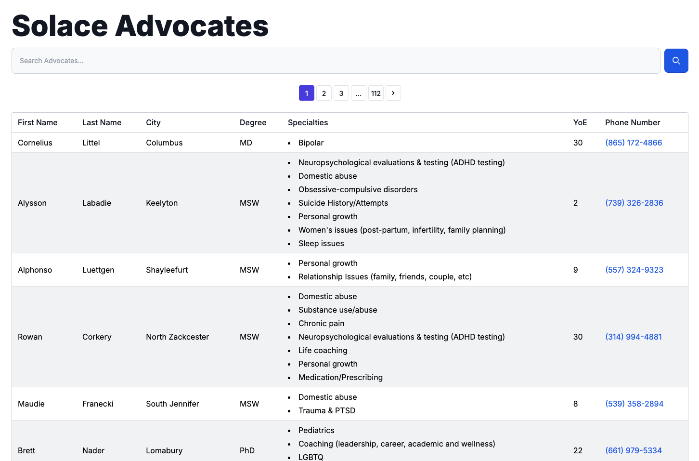
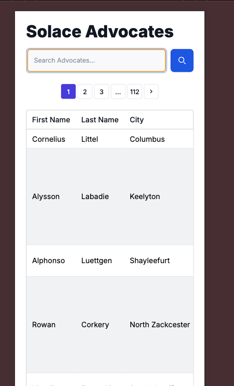

# Discussion

## Overview

The following PRs were merged as a submission for the assignment:  
https://github.com/gugzkumar/solace-candidate-assignment/pulls?q=is%3Apr+is%3Aclosed+is%3Amerged

The end result of the application looks as shown below:

A list of some, but not all, of the changes that were made:
- Updates to the styling of the page for a better user experience
- Implementation of pagination to support larger data sets
- Search and filter logic moved to the API
- Ability to search across multiple columns by separating multiple search terms with a `SPACE`
- Implementation of URL query parameters for search and pagination to support shareable links 
- Random advocate seeding to make it easier to test larger datasets

## Ideas for Improvement

Given the time constraints for this exercise, only a limited amount could be accomplished.  
This is a non-exhaustive list of other improvements that could be made if given more time.

### Features

- Having a loading visual, such as a spinner, when data is being fetched from the API
- Allowing users to search for a phone number using a human-friendly format like "(XXX) XXX-XXXX"
- An advanced search so the user can specify a different search query per column
    - For age, a range filter can be used when searching
    - For specialties, a fixed list of known specialties can be selected from
- Typing in the search bar can bring up autocomplete suggestions for the search
- Making the search bar sticky for mobile users
- Styling for a dark mode
- A “sort by column” feature
- A better design for the pagination bar
    - Showing a larger number of pages to select from as buttons on desktop or laptop
    - Showing more of the text field with the current page number for mobile users
    - NOTE: There is also the option of a “Load More” scroll alternative to pagination, which is more user-friendly for mobile users
- There is a lot of wasted real estate. The specialties column takes up a lot of room, and the remaining columns—which only have one line—feel like they waste a lot of space. Rather than keeping the table design for advocates, I would move toward a card design where the name, city, degree, years of experience, and phone number are in one column, and all the specialties are in another. This would also look a lot nicer on mobile.

### Optimizations, Technical Debt, and Bug Fixes

- Moving some of the repeated styles into a global stylesheet
- Updating the README with new scripts and explaining how to use random seeding
- A single script for standing up the database and application together
- Implementation of cursor-style pagination. The current offset and limit pagination strategy will slow down as the advocates table grows in size. A cursor-style approach, where the `WHERE` clause uses an indexed column such as the ID as a starting point, improves performance by avoiding a full table scan.
- Moving specialties out of a `jsonb` column and into their own table, along with a bridge table. This will create a many-to-many relationship between `advocates` and `specialties`.  
  Specialties appear to be a well-defined list. This is beneficial for several reasons, including:
    - Ensuring data integrity
    - Making it easier to add new specialties
    - Improving performance when searching for specialties